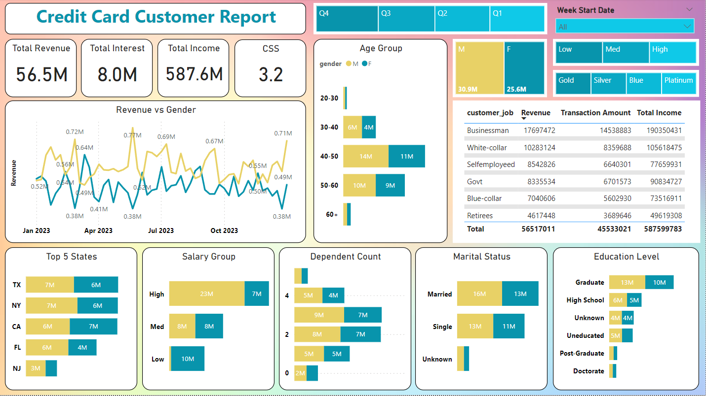
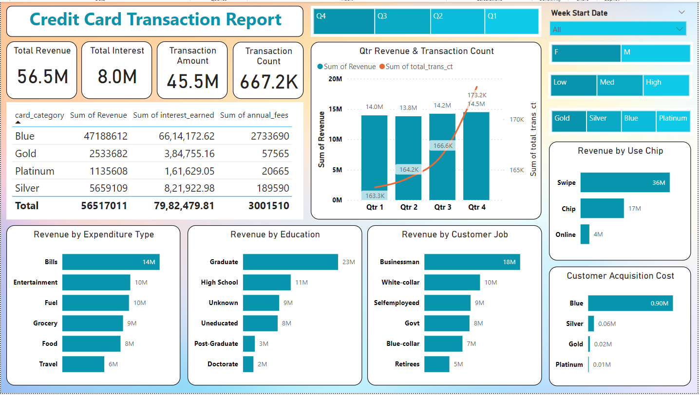

# Credit Card Customer Report
This Power BI project provides an interactive and comprehensive analysis of credit card customer data. It offers valuable insights into customer demographics, spending patterns, revenue streams, and other key metrics. The report is designed to help businesses in the credit card industry make data-driven decisions and improve their customer experience.

# Data Flow

The data for this project is stored in a database server, following industry best practices. The workflow is as follows:

### Database Setup: 
Initially, a database was created with the appropriate schema to store the credit card customer data.
### Data Ingestion: 
The raw data from Excel files was then copied into the database tables, ensuring data integrity and consistency.
### Power BI Integration: 
The Power BI Desktop application was connected to the database server, allowing it to directly fetch and analyze the data.

This setup ensures that when new data is added to the database, the Power BI report will automatically reflect the changes, providing up-to-date insights without manual intervention.

# Features

<li><b>Customer Demographics:</b> Explore customer profiles based on factors such as age, gender, marital status, education level, and employment status.
<li><b>Revenue Analysis:</b> Gain insights into revenue generation from various sources, including transaction fees, interest earned, and annual fees.
<li><b>Spending Patterns:</b> Understand customer spending behavior across different categories, such as bills, entertainment, fuel, groceries, food, and travel.
<li><b>Geographic Analysis:</b> Identify top-performing states and regions based on customer revenue contribution.
<li><b>Acquisition Cost:</b> Analyze customer acquisition costs by card category (Blue, Silver, Gold, and Platinum).
<li><b>Transaction Trends:</b> Track transaction counts and amounts over time, enabling better forecasting and resource allocation.
